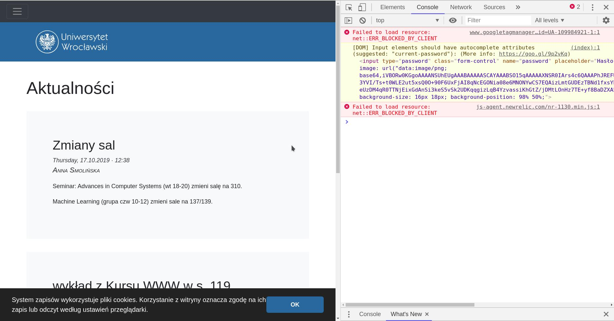
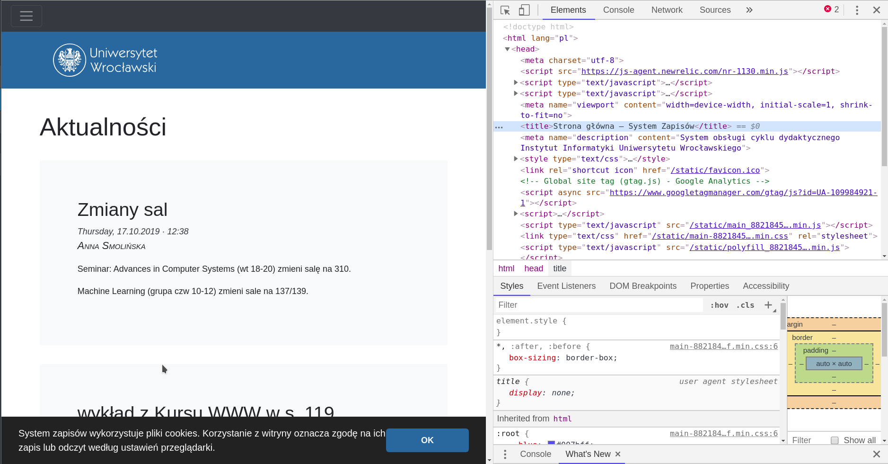
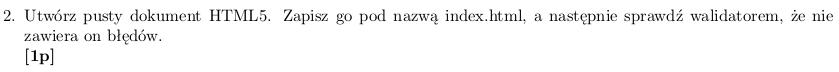
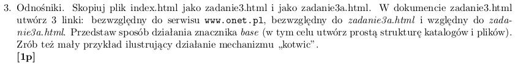
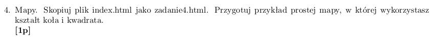
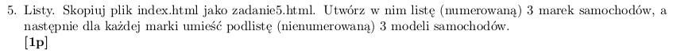
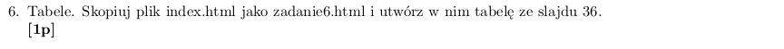
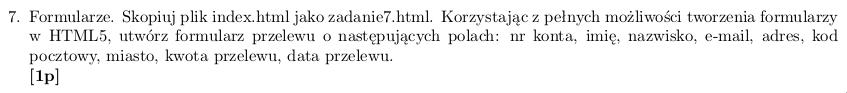
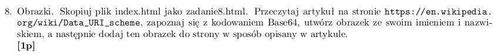
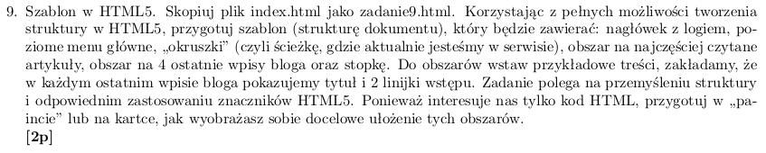

### Lista 2 do 21.10.2019, 22.10.2019 lub 24.10.2019

Zadanie 1

	
1. edycja title
	* otwoeramy narzędzia developerskie za pomocą `Ctrl+Shift+i`
	* wybieramy teraz elements 
	* nawigujemy do title ścierzką html->head->title 
	* edycja zmienia tytuł strony widoczny na liście kart 
2. popsucie css
	* analogicznie nawigujemy do html->head->link
	* strona traci style graficzne
3. powielenie newsa
	* klikamy prawym w narzędziach deweloperskich i kilkamy `Edit as html`
	* robimy kopię i edytujemy
	klikamy poza narzędzia developerskie żeby zatwierdzić zmiany

Zadanie 2

Zadanie 3

1. względność linków
	* bezwzględny zaczyna siędomeną lub `/` które oznacza bierzącą domenę
	* względny zaczyna się `./`
2. https://developer.mozilla.org/en-US/docs/Web/HTML/Element/base
3. link zakończony `#xyz` powoduje scroll do elementu z id `xyz`

Zadanie 4

Zadanie 5


```html
<ol>
	<li>
		Marka A
		<ul>
			<li>Auto A1</li>
			<li>Auto A2</li>
			<li>Auto A3</li>
		</ul>
	</li>
	<li>
		Marka B
		<ul>
			<li>Auto B1</li>
			<li>Auto B2</li>
			<li>Auto B3</li>
		</ul>
	</li>
	<li>
		Marka C
		<ul>
			<li>Auto C1</li>
			<li>Auto C2</li>
			<li>Auto C3</li>
		</ul>
	</li>
</ol>
```

Zadanie 6

```html
<body>
	<style>
		table {
			background-color: aqua;
		}

		table,
		th,
		td {
			border: 1px solid black;
		}

		th,
		td {
			padding: 0.33rem;
		}

		th {
			font-weight: 600;
			text-align: center;
			vertical-align: center;
		}
	</style>
	<table>
		<tbody>
			<tr>
				<th>Nr indeksu</th>
				<th>Ocena</th>
				<th>Grupa</th>
			</tr>
			<tr>
				<td>91044</td>
				<td>5.0</td>
				<td rowspan="2">Gr. 1</td>
			</tr>
			<tr>
				<td>91057</td>
				<td>5.0</td>
			</tr>
			<tr>
				<td colspan="3">Razem</td>
			</tr>
		</tbody>
	</table>
</body>
```
Zadanie 7


```html
<form action="">
	<input type="text" name="account-number" />
	<input type="text" name="firstname" autocomplete="given-name" />
	<input type="text" name="lastname" autocomplete="family-name" />
	<input type="email" name="email" autocomplete="email">
	<input type="text" name="address" autocomplete="address-line1">
	<input type="text" name="postal-code" autocomplete="postal-code">
	<!-- miasto
	kwota
	data -->
</form>
```

Zadanie 8

Zadanie 9

Dodatkowe uwagi

 